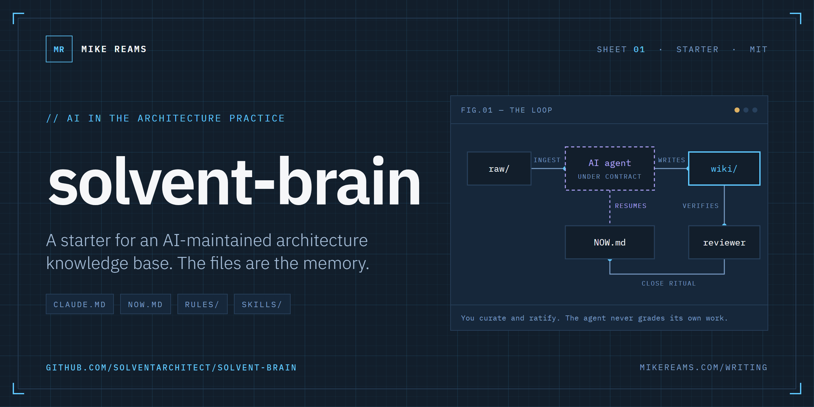
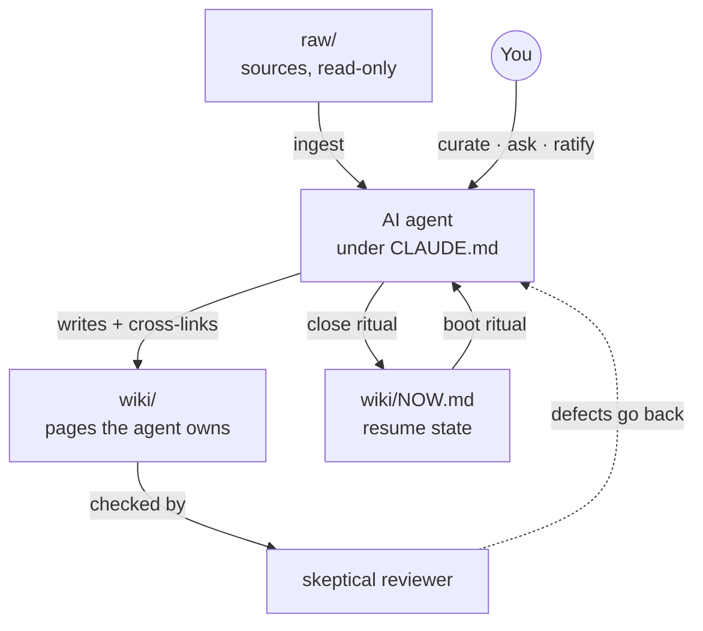

<p align="center">
  <a href="https://mikereams.com/writing/introducing-ea-brain-template">
    <picture>
      <source media="(prefers-color-scheme: dark)" srcset="assets/banner-dark.png">
      <source media="(prefers-color-scheme: light)" srcset="assets/banner-light.png">
      
    </picture>
  </a>
</p>

<p align="center">
  <a href="LICENSE"></a>
  <a href="https://github.com/solventarchitect/ea-brain/generate"></a>
  <a href="https://mikereams.com/writing"></a>
</p>

<p align="center"><b>The contract, resume state, rules and skills that let an AI agent maintain your architecture knowledge base, without letting it grade its own work.</b></p>

---

## Why this exists

Architecture knowledge lives everywhere at once: decisions in slide decks, the application inventory in the CMDB, reasoning in people's heads. Every new question starts with an afternoon of digging, and every answer goes stale the moment it is written down somewhere else.

ea-brain is the pattern that fixes that, reduced to files you can copy. Sources go into `raw/`. An AI agent reads them and writes a cross-linked wiki under a written operating contract. You curate, ask questions and ratify decisions. Nothing depends on a vendor, a database or a plugin: it is Markdown in a Git repository.

## How it works



Five ideas carry the whole thing:

| Idea | What it means in practice | Where it lives |
|---|---|---|
| **A written contract** | The agent's rules are a file you both change, not a prompt you retype. | `CLAUDE.md` |
| **The files are the memory** | Sessions forget. Every session opens by reading state and closes by writing it. | `wiki/NOW.md`, `wiki/log/` |
| **Never let the generator grade its own work** | An independent reviewer assumes the change is wrong until its checks pass. | `skills/skeptical-reviewer/` |
| **Every failure becomes a rule** | When the agent makes the same mistake twice, write the rule and paste it in. | `rules/` |
| **Spend the expensive model on judgment** | A cheaper, bounded operator runs the repeatable procedures. | `agents/operator.md`, `skills/_template/` |

## Quick start

1. Click **[Use this template](https://github.com/solventarchitect/ea-brain/generate)** (or clone the repo) to make your own copy.
2. Open `CLAUDE.md`, replace `<team/practice>` with your practice's name, and change anything that does not fit.
3. Drop one source into `raw/`: an export, meeting notes, a vendor notice.
4. Open an agent session in the folder and ask it to ingest the source. It reads `CLAUDE.md`, then `wiki/NOW.md`, and writes pages under `wiki/`.
5. End every session with the close ritual in `CLAUDE.md`. The files are the memory.

> [!TIP]
> Claude Code reads `CLAUDE.md` automatically. Any agent that can read files and follow instructions works too: point it at `CLAUDE.md`, or copy the contract into the file it reads. Open the folder as an Obsidian vault if you want a graph view; `.obsidian/` is already git-ignored.

## Install as an agent skill

Prefer to let your agent set it up? ea-brain also ships as a skill.

**Claude Code** (plugin marketplace):

```text
/plugin marketplace add solventarchitect/ea-brain
/plugin install ea-brain@solventarchitect
```

Then, in the folder you want to use: *"Set up an ea-brain knowledge base here for &lt;your practice&gt;."* The skill
copies the starter into the folder (it never overwrites existing files), names the practice in `CLAUDE.md`, starts
the log, and from then on handles boot, ingest, close and adding rules. It installs two skills:
`ea-brain` and `skeptical-reviewer`.

**Other agents and Claude.ai:** copy [`plugin/ea-brain/skills/ea-brain/`](plugin/ea-brain/skills/ea-brain) into
your agent's skills folder, or zip that folder and upload it as a custom skill. The folder is self-contained: the
starter files travel inside it, under `template/`.

> [!NOTE]
> Review any skill before you install it, this one included. It has no scripts and makes no network calls; it only
> reads its own `template/` folder and writes into the folder you point it at.

## What's inside

```text
ea-brain/
├── CLAUDE.md            operating contract
├── wiki/
│   ├── NOW.md           resume state
│   ├── index.md         catalog of every page
│   ├── inbox.md         open questions
│   └── log/             append-only, one file per month
├── raw/                 your sources (git-ignored)
├── rules/               seven rules, paste in whole
├── agents/operator.md   the bounded operator
├── skills/              skeptical-reviewer, _template
├── examples/            disposition record, golden questions
└── plugin/ea-brain/     the same starter, packaged as an agent skill
```

Each file links to the post that explains why it exists:

| File | What it is | Explained in |
|---|---|---|
| [`CLAUDE.md`](CLAUDE.md) | The operating contract: layers, rules, session rituals | [Building an AI Second Brain for Enterprise Architecture](https://mikereams.com/writing/building-an-ai-second-brain-for-enterprise-architecture) |
| [`wiki/NOW.md`](wiki/NOW.md) | Resume state: active threads, tripwires, ruled-out list | [Sessions Forget: Designing Resume State for AI Agents](https://mikereams.com/writing/sessions-forget-designing-resume-state-for-ai-agents) |
| [`rules/verify-before-assert.md`](rules/verify-before-assert.md) | Claims come from contents, not surfaces | [Green Tests, Broken System](https://mikereams.com/writing/green-tests-broken-system) |
| [`skills/skeptical-reviewer/SKILL.md`](skills/skeptical-reviewer/SKILL.md) | An independent reviewer that assumes the change is wrong | [Never Let the Generator Grade Its Own Work](https://mikereams.com/writing/never-let-the-generator-grade-its-own-work) |
| [`agents/operator.md`](agents/operator.md) | Instructions for the cheaper, bounded operator agent | [Two Tiers: Spend the Expensive Model Only on Judgment](https://mikereams.com/writing/two-tiers-spend-the-expensive-model-only-on-judgment) |
| [`skills/_template/SKILL.md`](skills/_template/SKILL.md) | Template for a bounded, repeatable skill | [Two Tiers](https://mikereams.com/writing/two-tiers-spend-the-expensive-model-only-on-judgment) |
| [`rules/two-lens-capabilities.md`](rules/two-lens-capabilities.md) | Every application: business capabilities plus one technical class | [Every App Needs Two Capabilities](https://mikereams.com/writing/every-app-needs-two-capabilities) |
| [`rules/pushed-is-not-deployed.md`](rules/pushed-is-not-deployed.md) | What counts as evidence of a deploy | [Pushed Is Not Deployed](https://mikereams.com/writing/pushed-is-not-deployed) |
| [`rules/guarded-writes.md`](rules/guarded-writes.md) | Writes to a system of record: dry run, window, confirm, read back | [A Dry Run Is Not Permission](https://mikereams.com/writing/a-dry-run-is-not-permission) |
| [`rules/servicenow-table-api.md`](rules/servicenow-table-api.md) | Table API behaviors that report success and store nothing | [Five ServiceNow API Calls That Return Success and Store Nothing](https://mikereams.com/writing/servicenow-api-calls-that-return-success-and-store-nothing) |
| [`examples/golden-questions.json`](examples/golden-questions.json) | The shape of an answer-quality eval set | [You Don't Need a Bigger Model. You Need Better Retrieval.](https://mikereams.com/writing/better-retrieval-not-a-bigger-model) |
| [`rules/record-rule.md`](rules/record-rule.md) | Which record a technology request produces | [Software Product or Business Application?](https://mikereams.com/writing/software-product-or-business-application) |
| [`examples/disposition-record.yaml`](examples/disposition-record.yaml) | A disposition with evidence, ratification and a review date | [A Disposition Is a Decision, Not a Field](https://mikereams.com/writing/a-disposition-is-a-decision-not-a-field) |
| [`rules/contract-reconcile.md`](rules/contract-reconcile.md) | Reconciling contract exports without false exits | [A Cancelled Contract Is Usually a Renamed One](https://mikereams.com/writing/a-cancelled-contract-is-usually-a-renamed-one) |

## Session rituals

| Ritual | What the agent does |
|---|---|
| **Boot** | Reads `CLAUDE.md`, then `NOW.md`, the active `inbox.md` and the last one or two log entries, and opens with what changed since the last session. |
| **Work** | Enriches existing pages before creating new ones, cites instead of restating, flags contradictions instead of overwriting, and stops to ask before deletes or production writes. |
| **Close** | Runs pending checks, updates `NOW.md`, appends a dated log entry, trims `inbox.md`, and commits. |

## Grow it in this order

1. **The contract and `NOW.md` alone**, until sessions boot and close cleanly.
2. **A rule the second time you catch the same mistake.** Start from `rules/` or write your own.
3. **The reviewer before the agent writes anything someone else will read.**
4. **The operator and a cheaper model tier** when routine work starts crowding out judgment.

## What this is not

A starter, not a product. There are no scripts, validators, metamodel or integrations. That is on purpose: the patterns travel between organizations, and the tooling does not, because it gets built around your own systems of record. Nothing in this repository comes from any organization's data, and `raw/` is git-ignored by default because sources usually are sensitive.

## The series

Every file here comes from *AI in the Architecture Practice* and *Application Portfolio Management* on [mikereams.com](https://mikereams.com/writing):

1. [Building an AI Second Brain for Enterprise Architecture](https://mikereams.com/writing/building-an-ai-second-brain-for-enterprise-architecture)
2. [Green Tests, Broken System: 4 Ways a Test Suite Lies](https://mikereams.com/writing/green-tests-broken-system)
3. [Never Let the Generator Grade Its Own Work](https://mikereams.com/writing/never-let-the-generator-grade-its-own-work)
4. [Sessions Forget: Designing Resume State for AI Agents](https://mikereams.com/writing/sessions-forget-designing-resume-state-for-ai-agents)
5. [Two Tiers: Spend the Expensive Model Only on Judgment](https://mikereams.com/writing/two-tiers-spend-the-expensive-model-only-on-judgment)
6. [Every App Needs Two Capabilities](https://mikereams.com/writing/every-app-needs-two-capabilities)
7. [Pushed Is Not Deployed](https://mikereams.com/writing/pushed-is-not-deployed)
8. [Introducing ea-brain](https://mikereams.com/writing/introducing-ea-brain-template)
9. [A Dry Run Is Not Permission](https://mikereams.com/writing/a-dry-run-is-not-permission)
10. [Five ServiceNow API Calls That Return Success and Store Nothing](https://mikereams.com/writing/servicenow-api-calls-that-return-success-and-store-nothing)
11. [You Don't Need a Bigger Model. You Need Better Retrieval.](https://mikereams.com/writing/better-retrieval-not-a-bigger-model)

Application Portfolio Management:

1. [Software Product or Business Application?](https://mikereams.com/writing/software-product-or-business-application)
2. [A Disposition Is a Decision, Not a Field](https://mikereams.com/writing/a-disposition-is-a-decision-not-a-field)
3. [A Cancelled Contract Is Usually a Renamed One](https://mikereams.com/writing/a-cancelled-contract-is-usually-a-renamed-one)

## Contributing

Issues are the most useful contribution: where the contract was unclear, where the agent went wrong, and which rule you had to add. The pattern got good because every failure became a rule. It will get better the same way.

## License

[MIT](LICENSE) © 2026 [Mike Reams](https://mikereams.com) · [LinkedIn](https://www.linkedin.com/in/mikereams/) · [X](https://x.com/thesolarchitect)
